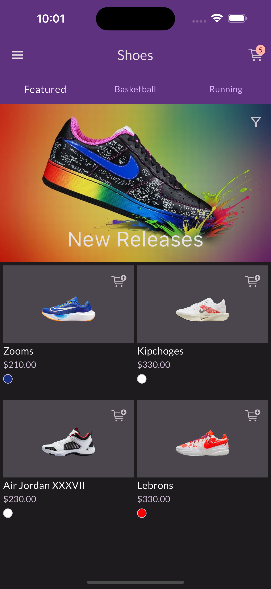
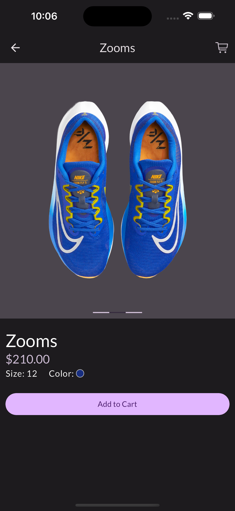
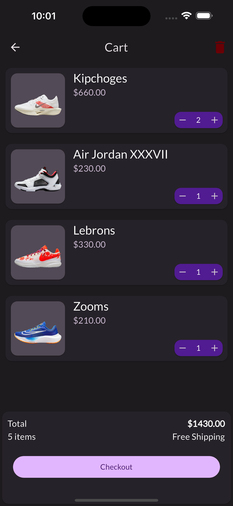
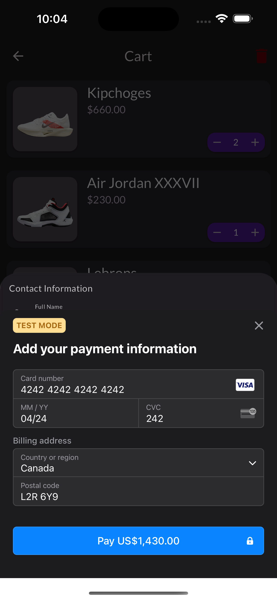
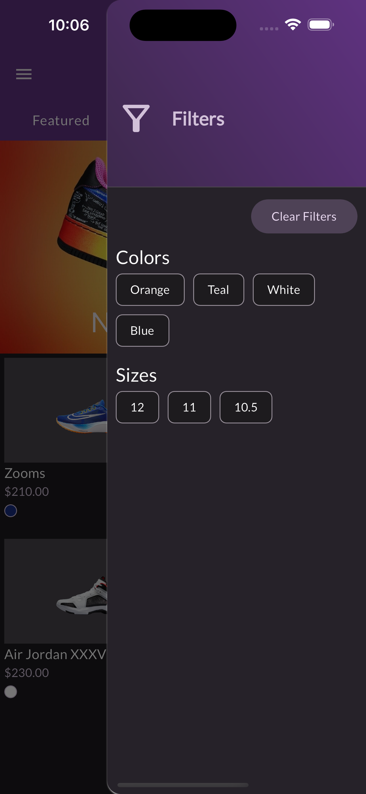

# E-commerce Flutter App

Welcome to the E-commerce Flutter App, your one-stop shopping companion for a seamless and convenient online shopping experience. This app empowers you to browse and purchase products from various categories with ease. With a user-friendly interface and robust features, it simplifies your e-commerce journey.

## Key Features

### Product Selection

- Explore a diverse catalog of products across various categories.
- Discover trending items and new arrivals effortlessly.

### Effortless Shopping

- Add products to your cart and proceed to a hassle-free checkout process.
- Conveniently manage your orders and track their status.

### Secure Transactions

- Rest assured that your payments are processed securely with integrated payment systems.

### User-Friendly Interface

- Enjoy an intuitive and visually appealing design for a smooth shopping experience.
- Accessible and easy-to-navigate layout.

### Cart Management

- Easily view and manage the items in your shopping cart.
- Review product details and make changes as needed.

### Order Tracking

- Keep track of your orders in real-time.
- Receive status updates and delivery information for your purchases.

## Accompanied Admin Dashboard Website

### Github Page

**E-commerce Admin Dashboard GitHub:** [GitHub Repository](https://github.com/kpirabaharan/E-Commerce-Admin-Dashboard)

### Website

Explore the live admin dasboard website: [E-commerce Admin Dashboard Website](https://e-commerce-admin-dashboard-kpirabaharan.vercel.app/)

## Technologies Used

- Flutter: A powerful and versatile UI toolkit for building natively compiled applications for mobile, web, and desktop from a single codebase.
- Dart: The programming language used for building Flutter apps.
- Stripe: Integration with the Stripe payment platform for secure and efficient payment processing.
- REST API: Integration with a Next.js backend for retrieving and managing product data and handling API calls.
- Riverpod: State management library for Flutter that simplifies the management of application state and dependencies, ensuring a more organized and maintainable codebase.

## Screenshots

### Overview Page

### Product Detail Page

### Cart Page

### Stripe Checkout

### Filters Sidebar

## License

This project is licensed under the [MIT License](https://opensource.org/licenses/MIT).

## Contact

If you have any questions or suggestions, please feel free to reach out:

- Email: kpirabaharan3@gmail.com
- LinkedIn: [https://linkedin.com/in/kpirabaharan/](https://linkedin.com/in/kpirabaharan/)
